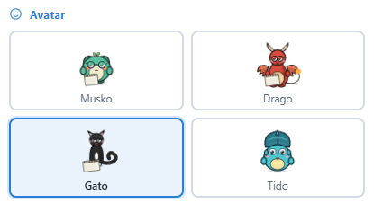
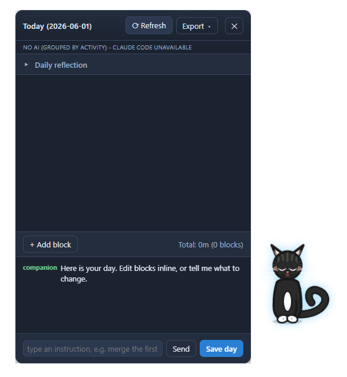
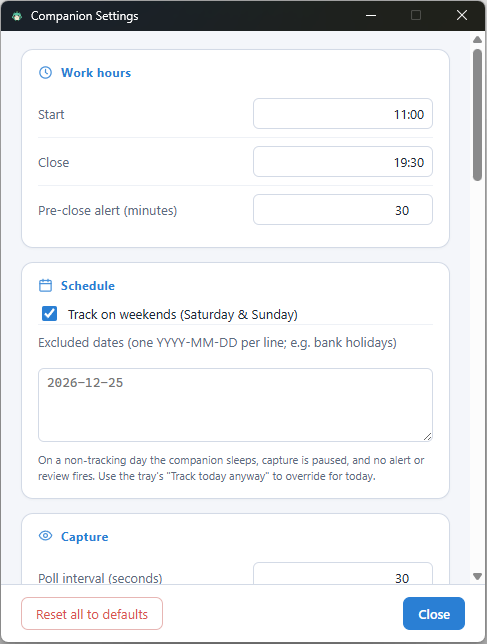

# Time-Tracking Buddy

An animated desktop companion that quietly captures your active-window activity during work hours and nudges you at the end of the day to review and log your time.

## What it is

If you bill by the hour, you know the problem: you mean to log your time, then a few busy days go by and you're reconstructing the week from memory and a messy calendar.

Time-Tracking Buddy is a small desktop pet that sits in the corner of your screen. While you work, it records which application and window you have in focus. At the end of your configured workday it wakes up, groups the day into a handful of editable time blocks, and lets you review, label, and save them — so logging your hours takes a minute instead of an act of archaeology.

Everything stays on your machine in a local SQLite database. Summarizing the day with AI is entirely optional; a built-in no-AI grouping works with nothing else installed.

## Screenshots

**The companion** — four avatars, each with idle / sleeping / alert / talking / reading / dragging states:



**End-of-day review** — your day grouped into editable, labelled time blocks:



**Settings** — work hours, capture, AI provider, and more:



## Features

- **Animated desktop companion** with four avatars (Musko, Drago, Gato, Tido). Each has idle, sleeping, alert, talking, reading, and dragging states, plus a "deepening sleep" sequence with cozy props (blanket, nightcap) as the day winds down.
- **Activity capture** of the focused app + window title at a configurable interval, with **idle detection** (pauses while you're away) and **retention pruning** (raw activity older than N days is deleted; your saved time entries are kept).
- **End-of-day review** that groups the day into editable time blocks — adjust times and labels, merge, split, add, or delete blocks by hand.
- **Three summarization options**, switchable in Settings, with **provider auto-detection**:
  - **Ollama** — a local LLM, nothing leaves your machine.
  - **Claude Code CLI** — summaries via Anthropic's `claude` command-line tool.
  - **No AI (group by activity)** — a deterministic algorithmic grouping that needs nothing installed and always works.
- **Chat-based refinement** when an AI provider is available ("merge the first two", "tag PROJ-42"), plus **manual editing that's always available** regardless of provider.
- **Review past / missed days** — pick any date and review or re-review it.
- **Per-block notes**, a **daily reflection**, and a **persistent scratchpad** for jotting things down. (Per-block notes are private and never sent to any AI.)
- **History & reports** view with per-day and per-ticket totals and **CSV export** for billing.
- **Weekend / holiday exclusion** with a manual **"Track today anyway"** tray override for the odd working Saturday.
- **Automatic daily backups** plus on-demand manual database backup.
- **Desktop and voice notifications** as the end of your workday approaches.
- **Configurable** work hours, capture interval, excluded-apps regex, avatar, companion size, and launch-on-startup.
- **All data stored in a local SQLite database** in your user data folder.

## Requirements

- **Windows** is the primary, tested platform.
- **macOS is experimental.** It builds via CI (GitHub Actions) and is published as an unsigned DMG, but has **not been verified on real Apple hardware** yet — treat it as unsupported until it has. It also needs **Screen Recording** permission to read window titles (see [macOS install](#macos-experimental)).
- To **build from source**: [Node.js](https://nodejs.org/) **20 or newer**. (The packaged app ships its own runtime via Electron 42; Node is only needed to build.)
- **AI is optional.** Ollama or the Claude Code CLI enable AI summaries, but the built-in **No-AI grouping works standalone** with nothing else installed.

## Download and install

For most people — no build tools required. Download the latest release and run it.

### Windows

1. Open the [Releases page](https://github.com/chriskokk/time-tracking-buddy/releases).
2. Under the latest release, download **Time-Tracking Buddy Setup `<version>`.exe**.
3. Run it. It installs per-user (no administrator rights needed) and adds Start Menu and Desktop shortcuts.

**SmartScreen note.** The installer isn't code-signed, so on first run Windows Defender SmartScreen may show **"Windows protected your PC"** and list the publisher as **"Unknown publisher"**. This is expected for an unsigned open-source app — click **More info**, then **Run anyway** to proceed.

### macOS (experimental)

> Not yet verified on real Apple hardware (see [Requirements](#requirements)) — use at your own risk.

Once a macOS build is published, download the `.dmg` from the [Releases page](https://github.com/chriskokk/time-tracking-buddy/releases). It is **unsigned and not notarized**, so Gatekeeper blocks it on first open — **right-click the app → Open**, then confirm. On first launch, grant **Screen Recording** permission (System Settings → Privacy & Security → Screen Recording) so the app can read window titles, then restart it. Without it, the app still records which applications you use and the No-AI grouping and manual entry work normally — only window titles are unavailable. (A few apps also benefit from **Accessibility** permission.)

## Build and run (for developers)

```bash
git clone https://github.com/chriskokk/time-tracking-buddy.git
cd time-tracking-buddy
npm install

npm run dev          # run in development
npm run build:win    # build a Windows installer into dist/
npm run build:mac    # build a macOS DMG into dist/ (must run on a Mac)
```

Release binaries are produced by [GitHub Actions](.github/workflows/build.yml): pushing a `v*` tag builds on the Windows and macOS runners and attaches the installer and DMG to the matching GitHub Release. The repository never contains build output — `dist/` is gitignored — and since macOS apps can't be built on Windows, CI is how the DMG is produced.

> Build note: `electron-builder` extracts a `winCodeSign` cache that needs symlink-creation privilege on Windows. If the build fails with `Cannot create symbolic link` errors, run the build terminal **as Administrator**, or enable **Windows Developer Mode** (Settings → Privacy & security → For developers) and sign out and back in.

## Getting started

1. **Open Settings** (right-click the companion or the tray icon) and set your **work hours**.
2. **Let it run.** The companion captures your active-window activity during work hours and sleeps outside them.
3. **Review at end of day.** When your workday closes, the companion prompts you. Open the review, check the suggested time blocks, edit or relabel as needed, add tickets/notes, and **Save day**.
4. **View history and export.** Open **History** to see per-day and per-ticket totals and **export CSV** for your billing system.

Missed a day? Use **"Review a day…"** from the tray to open any past date.

## AI provider setup

Choose your provider under **Settings → AI Provider**. Unavailable providers are greyed out with a reason; use **Re-check** after starting one.

- **No AI (group by activity)** — the default safety net. A deterministic grouping of your activity into blocks. Needs nothing installed and sends nothing anywhere. Manual editing does the rest.
- **Ollama** — install [Ollama](https://ollama.com/), pull a model (e.g. `ollama pull gemma4:e4b`), and make sure it's running. Set the host/model in Settings. Runs entirely on your machine.
- **Claude Code CLI** — install and authenticate the [`claude` CLI](https://www.anthropic.com/claude-code). Pick Haiku (faster) or Sonnet. This sends the day's activity summary to Anthropic.

If your chosen provider is unavailable when a review runs, the app automatically falls back to the No-AI grouping so you always get a usable review.

## Privacy

**This is a personal, local tool — not a cloud service.** There is no account, no telemetry, and no analytics.

- **All your data stays on your machine**, in a local SQLite database in your user data folder (on Windows, `%APPDATA%\Time-Tracking Buddy\`). Window titles and application names are captured **only locally**.
- **Nothing is transmitted anywhere except to the AI provider you explicitly choose**, and that choice determines what (if anything) leaves your machine:
  - **No AI (group by activity):** sends **nothing**, anywhere.
  - **Ollama:** runs **entirely locally** — nothing leaves your machine.
  - **Claude Code CLI:** sends the **day's activity summary** to Anthropic to produce the summary. (Your private per-block notes are never included.)
- **Exclude sensitive apps.** Add patterns to the **excluded-apps** setting (e.g. your password manager, banking, or anything private) and those windows are never captured.
- Your private per-block notes are **never** sent to any AI — they are stored locally and used only by you.

## Contributing

Pull requests are welcome. This project is released as-is with limited support — see [CONTRIBUTING.md](CONTRIBUTING.md) for how to build, run, and submit changes.

## License

Time-Tracking Buddy is free software, licensed under the **GNU Affero General Public License v3.0**. See [LICENSE](LICENSE) for the full text.

Copyright (C) 2026 Christos Kokkinas

## Support

If you find this useful and want to support its development, you can do so via [GitHub Sponsors](https://github.com/sponsors/chriskokk). Entirely optional, and much appreciated.
